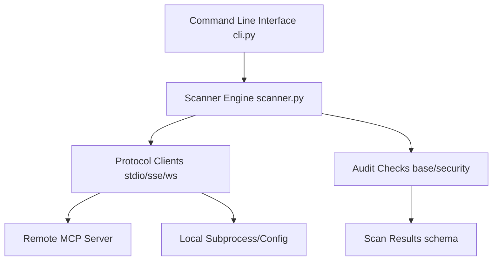

# MCP Server Scanner Architecture

This document describes the high-level architecture and component layout of the **MCP Server Scanner**.

## Core Components

1. **CLI Layer (`cli.py`)**: Consumes CLI arguments from the user and directs the scanning engine.
2. **Scanner Engine (`core/scanner.py`)**: Orchestrates the discovery of local config directories, initiates network connection handshakes, fetches server profiles, and runs checks.
3. **Protocol Clients (`protocols/`)**: Abstracts transport communication (Stdio execution, SSE stream subscription, WebSocket connections) into unified protocol client layers.
4. **Audit Checks (`checks/`)**: Modular rules executing validation checks against servers, detecting insecure actions or incorrect JSON-RPC compliance.
5. **Data Schema (`models/schemas.py`)**: Structured Pydantic contracts enforcing types for inputs, scan results, and tool details.
